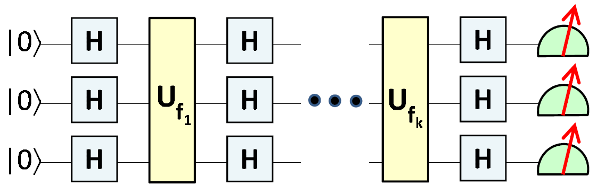

# Quantum Generative Adversarial Network for k-Forrelation Dataset

**This is a currently a work in progress.**

This project investigates whether Quantum Generative Adversarial Network (QuGAN) can be used to generate the [k-Forrelation Dataset](https://github.com/marklong-pg/k-forrelation-dataset). 

Classically generate the k-Forrelation is challenging:
* The positive class is exponentially rare at larger problem sizes, making it prohibitively difficult to sample a balanced dataset

* Random sampling in the function space is incapable of generating examples with high positive thresholds, which requires the development of a novel sampling algorithm

Each k-Forrelation instance can be represented as a quantum circuit with Hadamard layers alternating with encoding layers that describe each discrete Boolean function [(Aaronson, 2014)](https://arxiv.org/abs/1411.5729v1), as shown below:

 

It is natural to ask whether QuGAN can be used to generate the k-Forrelation datasets more easily. I.e., can the Generator in QuGAN learn the distribution of k-Forrelation instances with high $\Phi$ values?

> Note: Generation of the k-Forrelation dataset using classical GAN is yet to be attempted. So far, the project is simply motivated by the theoretical formulation of k-Forrelation as quantum circuits

The QuGAN architecture is based on the paper by [Dallaire-Demers & Killoran (2018)](https://arxiv.org/abs/1804.08641)